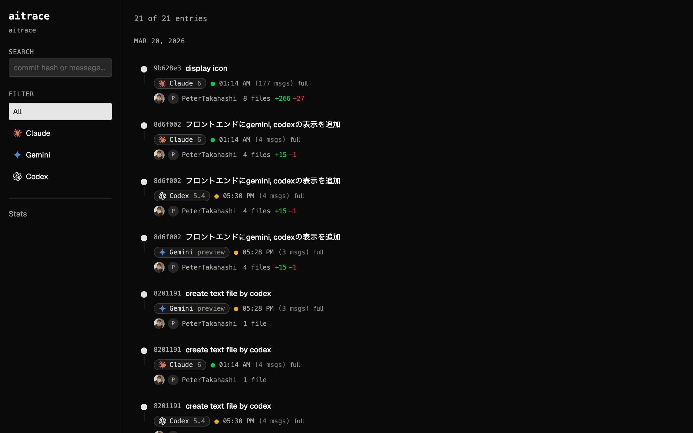
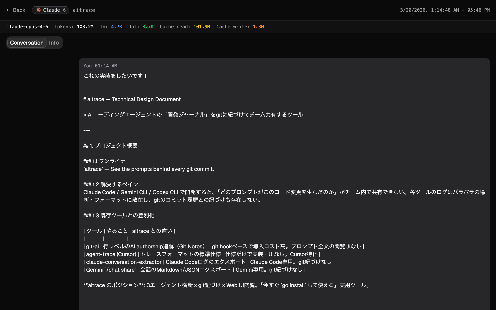
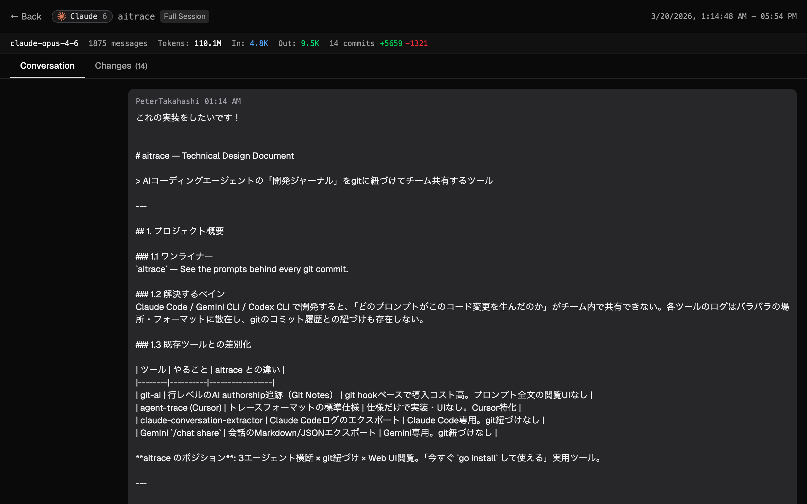
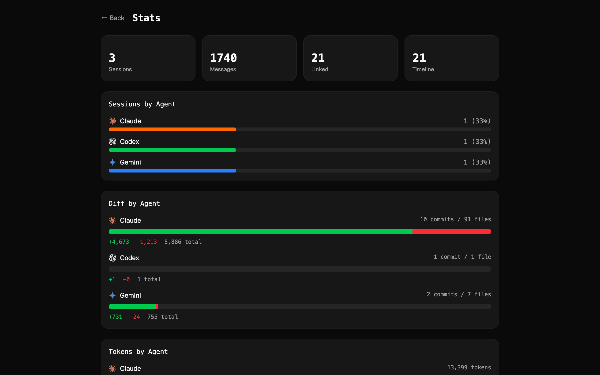

# commitlog-ai

> すべてのgitコミットの裏にあるプロンプトを見る

**commitlog-ai** は、AIコーディングエージェントの会話ログをgitの履歴に紐づけ、AI支援開発の全体像をチームで共有するためのツールです。

## 課題

Claude Codeを日常的に使っていても、`git log`には*何が*変わったかしか記録されません。*なぜ*変更したのか、*どのプロンプト*で、*どのモデル*を使ったのかは分かりません。ログは隠しディレクトリに散在し、gitとの紐づけも存在しません。

## 解決策

commitlog-aiはエージェントのログ（Claude Code、Gemini CLI、Codex CLI）を読み取り、統一フォーマットに変換し、タイムスタンプでgitコミットとマッチングし、Web UIで閲覧できるようにします。ログ内のAPIキーやシークレットは自動的にマスクされます。

```
エージェントログ ──▶ commitlog-ai parse ──▶ commitlog-ai link ──▶ commitlog-ai serve
(Claude/Gemini/Codex)                                        │
                                                     localhost:3100
                                               タイムライン + 会話 + Diff
```

## クイックスタート

```bash
go install github.com/PeterTakahashi/commitlog-ai/cmd/commitlog-ai@latest

cd your-project

# 方法1: オールインワン（推奨）
commitlog-ai serve --build    # parse + link + serve、新コミット検知で自動リビルド

# 方法2: バックグラウンド起動
commitlog-ai serve --build -d # 上記と同じだが、バックグラウンドで実行
commitlog-ai stop             # バックグラウンドサーバーを停止
```


```bash
# 方法3: 個別に実行
commitlog-ai parse            # エージェントログを読み取り → 統一フォーマットへ変換
commitlog-ai link             # セッションとgitコミットを紐づけ
commitlog-ai serve            # Web UIを起動 (localhost:3100)
```

### .gitignore

以下を `.gitignore` に追加してください。これらのファイルはローカルで生成されるもので、コミットする必要はありません:

```gitignore
.commitlog-ai/cache.json
.commitlog-ai/timeline.json
.commitlog-ai/server.pid
.commitlog-ai/output/
```

**`.commitlog-ai/sessions/` はignoreしないでください** — コミットすることで、チーム内でAIセッションログをgit経由で共有できます。詳しくは[チーム同期](#チーム同期)を参照してください。

## 対応エージェント

| エージェント | 対応状況 | 最低バージョン | ログの場所 |
|-------------|---------|--------------|-----------|
| Claude Code | 対応済み | 1.0.0+ | `~/.claude/projects/` |
| Gemini CLI | 対応済み | 0.1.0+ | `~/.gemini/tmp/<project>/chats/` |
| Codex CLI | 対応済み | 0.1.0+ | `~/.codex/sessions/` |

> **注意**: commitlog-aiは各エージェントがディスクに書き出すローカルログファイルを読み取ります。エージェントのバージョンが古すぎてログフォーマットが異なる場合、パースに失敗する可能性があります。上記は互換性のあるログを生成する最も古いバージョンの目安です。動作確認済み: Claude Code 2.1.79、Gemini CLI 0.34.0、Codex CLI 0.116.0。

## 機能

- **`serve --build`** — 1コマンドで完結: parse、link、serve、さらに新しいgitコミットを検知して自動リビルド（2秒間隔のポーリング）。ビルド中はプログレスバーを表示。
- **`serve -d` / `stop`** — `-d`でバックグラウンドデーモンとして起動、`commitlog-ai stop`で停止
- **チーム同期** — セッションデータはユーザーごとのディレクトリ（`sessions/<user>/sessions.json`）に保存。複数の開発者がgitにコミットしてもマージコンフリクトが発生しない。`link`時に全メンバーのセッションを自動マージ。
- **ブランチフィルタリング** — Web UIでgitブランチごとにタイムラインをフィルタリング
- **キャッシュ** — parseとlinkの結果をキャッシュ。ソースファイルの変更、新しいコミット、パーサーバージョンの更新時のみ再ビルド。`--force`でバイパス可能。
- **APIキーの自動マスク** — OpenAI、Anthropic、AWS、Azure、GitHubトークンなどのシークレットを自動検出し、出力ファイルでマスク
- **Gitユーザー情報** — 各コミットにauthorの名前・メールアドレス・GitHubプロフィールアイコンを表示
- **セッション全体表示** — セッションの会話全文と、紐づく全コミットのコード変更を一画面で閲覧
- **コミットハッシュ検索** — コミットハッシュまたはコミットメッセージでリアルタイム検索
- **ポート自動フォールバック** — 3100番ポートが使用中の場合、空きポートを自動選択
- **サーバーサイドページネーション** — 数千コミットのリポジトリにも対応
- **Markdownエクスポート** — タイムライン全体を1枚のMarkdownファイルに出力

## コマンド

### `commitlog-ai status`

現在のプロジェクトで検出されたログソースと件数を表示します。

```
$ commitlog-ai status
Project: /Users/you/dev/myproject

  claude_code   3 log file(s)
  gemini_cli    1 log file(s)
  codex_cli     2 log file(s)
```

### `commitlog-ai parse`

検出されたすべてのエージェントログを統一JSONフォーマットに変換します。シークレットは自動的にマスクされます。出力は `.commitlog-ai/sessions.json` に書き込まれます。結果はキャッシュされ、ソースファイルが変更されるかパーサーバージョンが更新された時のみ再パースされます。

```
$ commitlog-ai parse
[claude_code] Found 3 log file(s)
  Session a1b2c3d4: 42 messages (09:15:30 to 10:22:45)
  Session e5f6g7h8: 18 messages (14:00:12 to 14:35:20)

Parsed 2 session(s) → .commitlog-ai/sessions.json
```

オプション:
- `--force` — キャッシュを無視して全ログを再パース

### `commitlog-ai link`

パースされたセッションをタイムスタンプベースのヒューリスティクスでgitコミットとマッチングします。出力は `.commitlog-ai/timeline.json` に書き込まれます。結果はキャッシュされ、sessions.jsonの変更や新しいコミットが検出された時のみ再リンクされます。

```
$ commitlog-ai link
Found 2 session(s) and 28 commit(s)
Linked 2 pair(s), 28 total entries → .commitlog-ai/timeline.json
```

オプション:
- `--force` — キャッシュを無視して再リンク

### `commitlog-ai serve`

紐づけられたタイムラインを閲覧するためのローカルWebサーバーを起動します。デフォルトポートが使用中の場合は、空きポートが自動で選択されます。

```
$ commitlog-ai serve
commitlog-ai server running at http://localhost:3100
  28 timeline entries, 2 sessions
```

オプション:
- `--build` — serve前にparse+linkを実行し、新しいgitコミットを検知して自動リビルド
- `-d, --daemon` — バックグラウンドで実行（`commitlog-ai stop`で停止）
- `--port <number>` — サーバーポート（デフォルト: 3100、使用中の場合は自動で別ポートにフォールバック）
- `--no-browser` — ブラウザの自動オープンを無効化

### `commitlog-ai stop`

`serve -d`で起動したバックグラウンドサーバーを停止します。

```
$ commitlog-ai stop
Server stopped (PID 12345)
```

### `commitlog-ai export`

紐づけられたタイムラインをJSONまたはMarkdownとしてエクスポートします。

```bash
# JSONバンドル
commitlog-ai export --format json
Exported → .commitlog-ai/output/timeline.json

# Markdownレポート（全会話を含む1ファイル）
commitlog-ai export --format markdown
Exported → .commitlog-ai/output/timeline.md
```

オプション:
- `--format json` — JSONバンドル（デフォルト）
- `--format markdown` — サマリー、コミット詳細、会話全文を折りたたみセクションで含む1枚のMarkdownファイル

## マッチングの仕組み

commitlog-aiは信頼度スコア付きのアルゴリズムでセッションとコミットを紐づけます:

1. **時間重複** — コミットのタイムスタンプがセッションの時間範囲内 → 信頼度90%
2. **セッション後のコミット** — セッション終了後5分以内のコミット → 信頼度70%
3. **セッション前のコミット** — セッション開始前5分以内のコミット → 信頼度50%
4. **ファイルパスの重複ボーナス** — ツールコールで操作されたファイルとコミットの変更ファイルが一致 → +10%
5. **ブランチ一致ボーナス** — セッションのgitブランチが一致 → +5%

マッチしなかったコミットやセッションは単独エントリとして表示されます。

## Web UI

Webビューアは4つのビューを提供します:

- **タイムライン** — git log風の一覧表示。インフィニットスクロール、サーバーサイドページネーション、エージェントフィルタ、ブランチフィルタ、コミットハッシュ・メッセージ検索対応。各エントリにコミットauthorのGitHubアバター・名前・変更ファイル数を表示。
- **セッション詳細** — 左に会話セグメント（「You」ではなくコミットauthorの名前を表示）、右にgit diffの分割ビュー。ツール承認メッセージは承認したツール名とともにインライン表示。
- **セッション全体** — セッションの会話全文と、紐づく全コミットのコード変更を折りたたみ可能なdiffで表示する専用画面。
- **統計** — エージェント別セッション数、diff・トークン統計、紐づけ状況のダッシュボード

### スクリーンショット

| タイムライン | セッション詳細 |
|------------|--------------|
|  |  |

| セッション全体 | 統計 |
|--------------|------|
|  |  |

## チーム同期

commitlog-aiはマルチ開発者ワークフローを標準でサポートしています。セッションデータはユーザーごとのディレクトリに保存されるため、マージコンフリクトが発生しません:

```
.commitlog-ai/
  sessions/
    petertakahashi/sessions.json    ← 自分のセッション
    alicejohnson/sessions.json      ← チームメイトのセッション（git pullで取得）
  timeline.json                     ← ローカルのみ（.gitignore）
  cache.json                        ← ローカルのみ（.gitignore）
```

チーム同期を有効にする手順:

1. `.commitlog-ai/sessions/` をgitにコミット（デフォルトでgitignoreされていない）
2. 各開発者が `commitlog-ai parse` を実行して自分のセッションを書き出す
3. `commitlog-ai link` が全メンバーのセッションを読み込んでgitコミットとマッチング
4. Web UIで全員のセッションを閲覧 — どのプロンプトがどのコミットにつながったかが分かる

ユーザーの識別は `git config user.name` に基づきます（ディレクトリ名に安全な形にサニタイズ）。

## アーキテクチャ

- **Go CLI** — シングルバイナリ、外部依存ゼロ（データベース不要、Docker不要）
- **React SPA** — Vite + TypeScript + Tailwind CSS v4 + shadcn/uiで構築、`go:embed`でGoバイナリに組み込み
- **JSONベース** — すべてのデータは `.commitlog-ai/` にJSONファイルとして保存。ポータブルでgitフレンドリー。serve時にメモリにロードし、サーバーサイドページネーションで配信。
- **キャッシュ** — ファイル更新時刻+サイズでparseキャッシュ、git HEADハッシュでlinkキャッシュ。メタデータは `.commitlog-ai/cache.json` に保存。パーサーバージョン変更で全キャッシュ無効化。
- **ホットリロード** — `serve --build` は `sync.RWMutex` を使用し、APIハンドラがリクエストを処理し続ける中で安全にデータを入れ替え
- **シークレットサニタイザー** — 正規表現ベースでAPIキー・トークン・認証情報を検出し、ファイル書き出し前にマスク

## 開発

```bash
# フルビルド (web + Go)
cd web && npm run build && cd ..
rm -rf internal/server/dist && cp -r web/dist internal/server/dist
go build -o bin/commitlog-ai ./cmd/commitlog-ai/

# 開発モード: Vite dev server + Go APIを別々に起動
cd web && npm run dev          # Viteが:5173で起動（/apiを:3100にプロキシ）
go run ./cmd/commitlog-ai/ serve    # Go APIが:3100で起動
```

### プロジェクト構造

```
cmd/commitlog-ai/           CLIエントリポイントとサブコマンド
internal/
  model/               統一データ型（Session, Message, Timeline）
  parser/              ログパーサー（Claude Code、Gemini CLI、Codex CLI）
  linker/              Git操作とタイムスタンプベースのマッチング
  builder/             プログレス報告付き統合parse+linkロジック
  cache/               パーサーバージョン管理付きparse/linkキャッシュ
  exporter/            JSONおよびMarkdownエクスポート
  sanitizer/           APIキー・シークレットのマスク処理
  userpath/            ユーザーごとのセッションパスとチーム同期ユーティリティ
  server/              組み込みReact SPAとページネーション付きAPIのHTTPサーバー
web/                   Reactビューア（Vite + TypeScript + Tailwind + shadcn/ui）
```

## ライセンス

MIT
